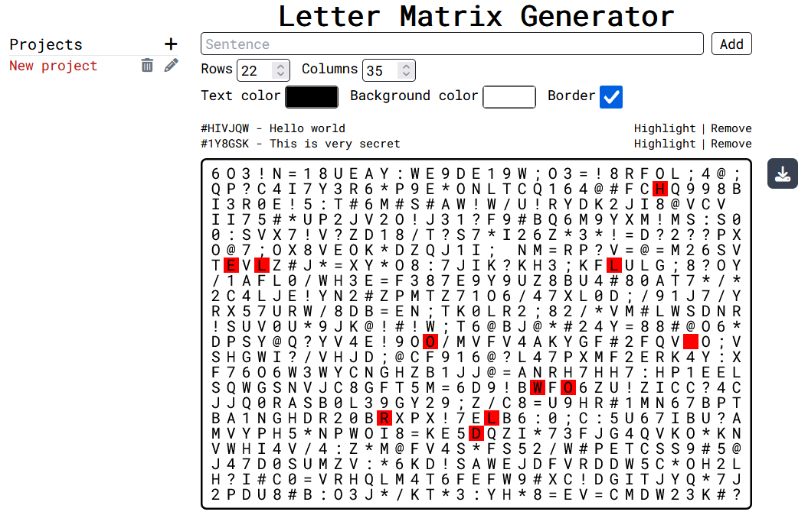

# Letter Matrix



Letter Matrix is a web application for creating hidden codes concealed within a large matrix of letters. To decode the hidden message, you need a specific key that reveals which letters in the matrix are relevant.

You can try the live version here: [https://letter-matrix.netlify.app/](https://letter-matrix.netlify.app/)

## Features

- Create hidden messages within a letter matrix.
- Generate keys to decode messages.
- Customizable settings.

## Local Setup

To run this project locally, follow these steps:

1. **Clone the repository:**

    ```bash
    git clone https://github.com/DenseOriginal/letter-matrix.git
    cd letter-matrix
    ```

2. **Install dependencies:**

    ```bash
    npm install
    # or
    yarn install
    # or
    pnpm install
    ```

3. **Start the development server:**

    ```bash
    npm run dev
    # or
    yarn dev
    # or
    pnpm dev
    ```

4. **Open your browser:**
    Navigate to the URL shown in the terminal (usually `http://localhost:5173`).

## Building for Production

To build the project for production, run:

```bash
npm run build
```
